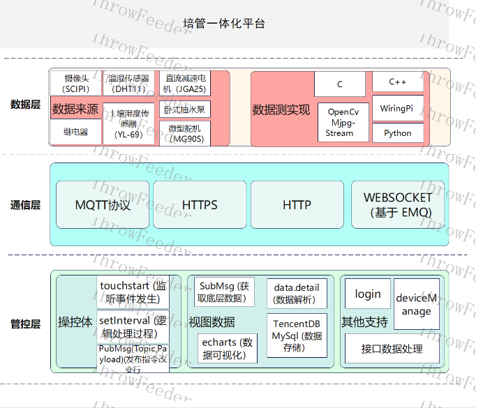
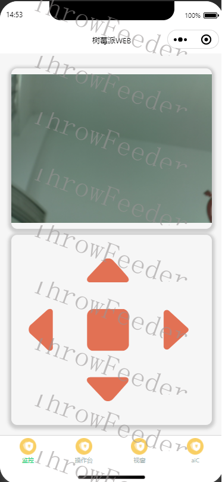
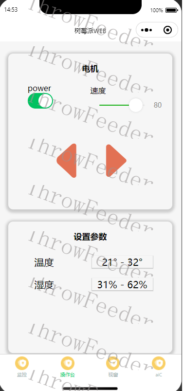
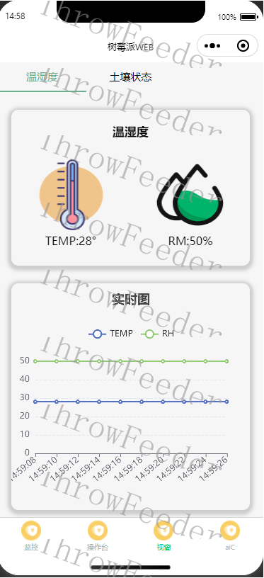

# 简介

该作品作为入门练手项目，实现模拟智慧大棚环境，集成统一管理控制。终端基于树莓派3b+实现数据采集和硬件控制，客户端基于微信小程序云开发实现数据集成与指令发布。

# 培管一体化平台核心功能

1. 云台监控：使用摄像头并搭载云台，模拟监控。实现棚内外环境实时监控，可通过实时画面了解当前棚内作物情况及周边环境，为即使做出正确判断提供参照。

2. 操控台：在知道棚内环境的情况下，可自主控制棚内现有设备的基本操作，而在不知晓棚内环境情况时，可通过云台监控获取当前棚内环境信息，依旧可做出相应操作。

3. 视窗：实时采集获取当前棚内所有传感器的相关数据，并通过Echarts等相关技术，将部分数据可视化；管理员可在一个页面查看当前所有传感器的数据变化，以便掌握精确的数据，为提高作物质量。

4. 语音控制室：使用同声传译实现语音转文字发布指令，完成对设备的响应操作。

5. 远程控制：使用MQTT通信协议，通过EMQ服务器实现客户端的发布订阅，完成客户端对硬件设备的远距离操控。

# 整体架构

# 运行状态截选展示

